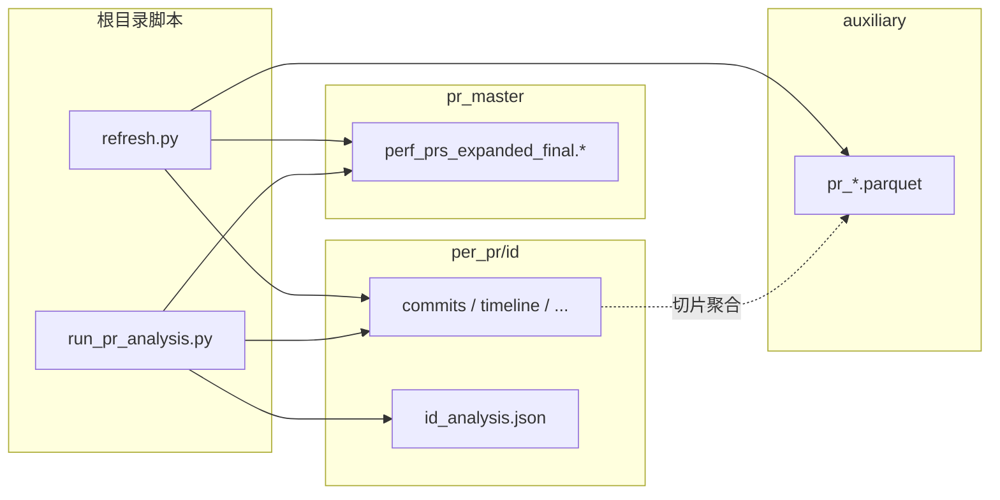

# AI Agent 性能 Pull Request 数据集 — 仓库文件结构说明

本仓库以 `finaldatabase/` 为核心，存放毕业设计研究所用的 AI Agent 性能 Pull Request 语料：主表、GitHub 附属数据与 LLM 结构化分析结果；根目录脚本与配置文件负责 PR 状态同步与 LLM 分析流程。下文按目录说明各文件含义，并总结重复出现的命名规律。

```
仓库根目录/
├── finaldatabase/                 # 数据集根目录（见下文）
├── output_pr_analysis/             # run_pr_analysis.py 批量运行汇总（可选，本地生成）
├── refresh.py
├── run_pr_analysis.py
├── prompt.md
├── schema.json
├── README.md
├── .gitignore
├── .github_token                   # 本地 GitHub Token（已 gitignore，不入库）
├── {pr_id}_analysis.json           # 少量 few-shot 样例（根目录副本，见根目录文件表）
└── …
```

---

## 根目录文件

| 文件 / 目录 | 含义 |
|-------------|------|
| `finaldatabase/` | 全部结构化 PR 数据与按 PR 拆分的附属文件 |
| `refresh.py` | 调用 GitHub API 复核 open PR 状态；404 从数据集中删除；更新主表与 `summary/` 报告 |
| `run_pr_analysis.py` | 从 `per_pr/{id}/` 与主表组装 prompt，调用 DeepSeek，写入 `{id}_analysis.json` 等 |
| `prompt.md` | LLM 系统提示词（固定指令块；与 `schema.json`、目标 PR 数据拼成完整 prompt） |
| `schema.json` | 分析输出 JSON 的字段说明与模板（`run_pr_analysis.py` 校验结构时参照） |
| `README.md` | 本说明 |
| `.gitignore` | 忽略缓存、本地密钥等 |
| `.github_token` | `refresh.py` 读取的 GitHub Personal Access Token（仅本地） |
| `{pr_id}_analysis.json` | **Few-shot 样例**：与 `run_pr_analysis.py` 中 `FEWSHOT_PR_IDS` 对应的分析结果副本，便于对照 prompt / 字段格式（正式产出在 `finaldatabase/per_pr/{pr_id}/` 下） |
| `output_pr_analysis/` | 批量分析时的累计报告：`batch_run_report.json`、`batch_run_report.md`（token、耗时、费用统计） |

根目录当前 few-shot 样例文件（与 `per_pr/` 内同名 JSON 内容对应，路径不同）：

- `3022909076_analysis.json`、`3074351366_analysis.json`、`3125029980_analysis.json`
- `3145702280_analysis.json`、`3194284966_analysis.json`、`3228424652_analysis.json`

---

## `finaldatabase/` 总览

```
finaldatabase/
├── README.md                       # 数据集快照摘要（条数、状态分布、最近一次 refresh）
├── pr_master/                      # PR 主表（一行一条 PR）
├── paper_source_copy/              # 论文用筛选表的副本
├── auxiliary/                      # 全库聚合附属表（按 pr_id 纵向堆叠）
├── classification/                 # 主题 / 任务类型等分类结果
├── per_pr/                         # 按 GitHub PR id 分目录的单 PR 数据
└── summary/                        # 覆盖率、刷新报告、GitHub 缓存与调试样例
```

当前规模（以 `summary/coverage_stats.json` 为准）：主表 **1219** 条 PR；`per_pr/` 下 **1219** 个子目录（与主表 `id` 一一对应，删除 404 PR 后会同步减少）。

---

### `finaldatabase/pr_master/`

| 文件 | 含义 |
|------|------|
| `perf_prs_expanded_final.csv` | **完整主表**（CSV）。每行一条 PR，含 GitHub 元数据、Agent、BERTopic、检测来源、LLM 辅助字段等 |
| `perf_prs_expanded_final.parquet` | 同上内容的 Parquet 版 |
| `POP_PULL_Requests_LLM_filtered_final.csv` | **论文/下游用窄表**：在完整主表基础上去掉部分扩展列（如 `row_1based`、`status`、Topic 相关、`llm_output` 等，逻辑见 `refresh.py` 中 `PAPER_BASE_EXCLUDE`） |

主表关键列（节选）：`id`（GitHub PR 全局 id，全库主键）、`number`、`title`、`body`、`agent`、`user`、`state`、`status`（derived：open / merged / closed）、`html_url`、`created_at` / `merged_at` / `closed_at`、`detection_source`、`aidev_task_*`、`Topic` / `Probability` 等。

---

### `finaldatabase/paper_source_copy/`

| 文件 | 含义 |
|------|------|
| `POP_PULL_Requests_LLM_filtered_final.csv` | 与 `pr_master/` 中同名文件相同；单独目录便于论文写作或外部分发时只拷贝这一份 |

**重复规律：** `pr_master/` 与 `paper_source_copy/` 共享同一份「筛选后主表」CSV，内容一致、路径不同。

---

### `finaldatabase/auxiliary/`

全库级 **Parquet 大表**：所有 PR 的某类 GitHub 数据纵向合并，通过列 **`pr_id`**（或下表中的其它键）与主表 `id` 关联。`refresh.py` 删除 PR 时会按 `pr_id` 过滤这些表。

| 文件 | 内容概要 | 关联主键 |
|------|----------|----------|
| `repository.parquet` | 仓库元信息 | `id`（repo id） |
| `pr_commits.parquet` | PR 下各 commit 摘要 | `pr_id` |
| `pr_commit_details.parquet` | commit 内逐文件改动（含 patch 等） | `pr_id` |
| `pr_reviews.parquet` | Formal review | `pr_id` |
| `pr_review_comments_v2.parquet` | 行内 review comment | `pull_request_review_id`（需经 `pr_reviews` 映射到 `pr_id`） |
| `pr_comments.parquet` | PR 讨论区 comment | `pr_id` |
| `pr_timeline.parquet` | PR 时间线事件 | `pr_id` |
| `related_issue.parquet` | PR 关联 issue | `pr_id` |
| `issues_linked.parquet` | issue 详情（与 related_issue 联动） | `id`（issue id） |

**与 `per_pr/` 的对应关系（命名规律）：**

| `auxiliary/`（全库聚合） | `per_pr/{pr_id}/`（单 PR 切片） | 说明 |
|--------------------------|----------------------------------|------|
| `pr_commits.parquet` | `commits.parquet` | 聚合表加 `pr_` 前缀 |
| `pr_commit_details.parquet` | `commit_details.parquet` | 同上 |
| `pr_reviews.parquet` | `reviews.parquet` | 同上 |
| `pr_comments.parquet` | `comments.parquet` | 同上 |
| `pr_timeline.parquet` | `timeline.parquet` | 同上 |
| `related_issue.parquet` | `related_issue.parquet` | 名称一致 |
| （`pr_review_comments_v2` 仅聚合表） | `review_comments.parquet` | 单 PR 目录内文件名略不同 |

并非每条 PR 都具备全部附属文件（例如无 review 则可能没有 `reviews.parquet`）；`run_pr_analysis.py` 读取单 PR 目录时，缺失文件按空表处理。

---

### `finaldatabase/classification/`

| 文件 | 含义 |
|------|------|
| `bertopic_topic_assignments.parquet` | 各 PR 的 BERTopic 主题分配 |
| `bertopic_topic_info.csv` | 主题 id、关键词等主题表信息 |
| `aidev_pr_task_type_for_perf_prs.parquet` | AIDev 任务类型（fix / perf / feat 等）分类结果 |

字段与主表中的 `Topic`、`aidev_task_type` 等列相互对应，可用于离线分析或校验。

---

### `finaldatabase/per_pr/{pr_id}/`

**目录命名：** `{pr_id}` = 主表 `id`（GitHub Pull Request 的数字 id，非仓库内 `#number`）。

每个子目录对应主表中的一条 PR，存放该 PR 的 GitHub 明细与分析产出。典型结构如下（文件是否齐全因 PR 而异）：

```
per_pr/{pr_id}/
├── commits.parquet              # 该 PR 的 commits
├── commit_details.parquet       # 该 PR 的文件级改动明细
├── timeline.parquet             # 时间线（几乎每条 PR 都有）
├── comments.parquet             # 讨论 comment（可选）
├── reviews.parquet              # review（可选）
├── related_issue.parquet        # 关联 issue（可选）
├── review_comments.parquet      # 行内 review comment（可选）
├── {pr_id}_analysis.json        # LLM 结构化分析结果（schema 见 schema.json）
├── {pr_id}_analysis_run.json    # 单次 API 调用的 meta：model、usage、费用等
├── {pr_id}_workflow_prompt.txt  # 可选；--save-prompt / --dry-run 时保存的完整 prompt
└── {pr_id}_analysis.json.raw.txt # 解析失败时的原始模型输出（异常时才有）
```

**重复 / 命名规律小结：**

1. **目录名 = 主键：** 文件夹名与主表 `id`、`auxiliary.*.pr_id`、分析 JSON 文件名中的 `{pr_id}` 相同。
2. **Parquet 与聚合表成对：** 单 PR 下无 `pr_` 前缀的文件，合并后即 `auxiliary/pr_*.parquet` 中对应行。
3. **分析产物三件套：** `{pr_id}_analysis.json`（结果）+ `{pr_id}_analysis_run.json`（运行元数据）；prompt 文本可选落盘。
4. **根目录 vs `per_pr/`：** few-shot 的 `{pr_id}_analysis.json` 在根目录留一份副本，正式数据以 `per_pr/{pr_id}/` 为准。

---

### `finaldatabase/summary/`

| 文件 | 含义 |
|------|------|
| `coverage_stats.json` | 数据集总览：PR 数量、状态分布、最近一次 status refresh、附属表删行统计等 |
| `status_refresh_report.json` | `refresh.py` 明细：哪些 open PR 变更、哪些 404 被移除 |
| `github_status_cache.json` | GitHub PR 状态 API 缓存（按 `pr_id`） |
| `github_auxiliary_cache.json` | 拉取附属数据时的 GitHub 缓存 |
| `auxiliary_incremental_report.json` | 附属表增量同步记录（按 PR 统计新增行） |
| `_sample_schema.json` | 各附属表字段的样例行（调试 / 文档用） |
| `_gh_timeline_sample.json` | Timeline API 样例 |
| `_closed_timeline.json`、`_commented_timeline.json`、`_reviewed_timeline.json` | 不同事件类型的 timeline 样例 |
| `_tl_types695.json` | Timeline 事件类型相关样例 |

**命名规律：** 无下划线前缀的为**运行产物或正式统计**；以 `_` 开头的多为**抽样 / 调试 JSON**，不参与主流程读写。

---

## 数据流关系（便于定位文件）



- **查一条 PR 的全貌：** `pr_master` 行 → `per_pr/{id}/` → 需要时 JOIN `auxiliary` 或 `classification`。
- **全库统计 / 论文表：** `pr_master` 或 `paper_source_copy` 的 POP 筛选 CSV + `summary/coverage_stats.json`。
- **LLM 分析：** 输入来自 `per_pr/{id}/` + 主表；输出写回同目录下 `{id}_analysis.json`。

更细的单次刷新数字见 [`finaldatabase/README.md`](finaldatabase/README.md) 与 [`finaldatabase/summary/coverage_stats.json`](finaldatabase/summary/coverage_stats.json)。
