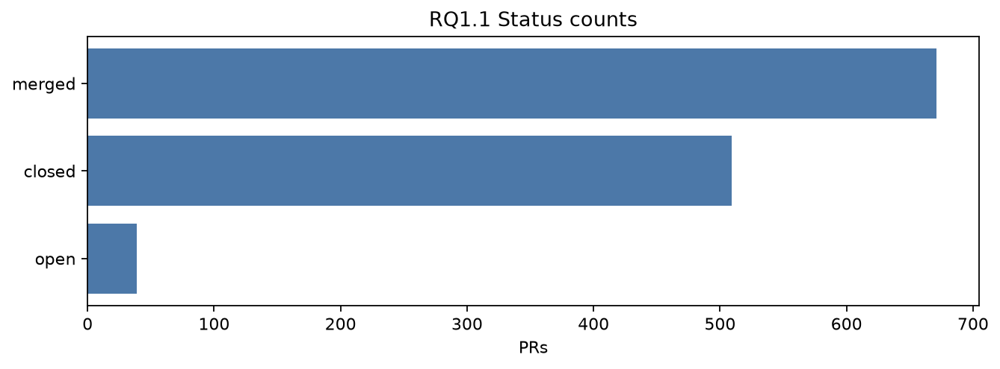
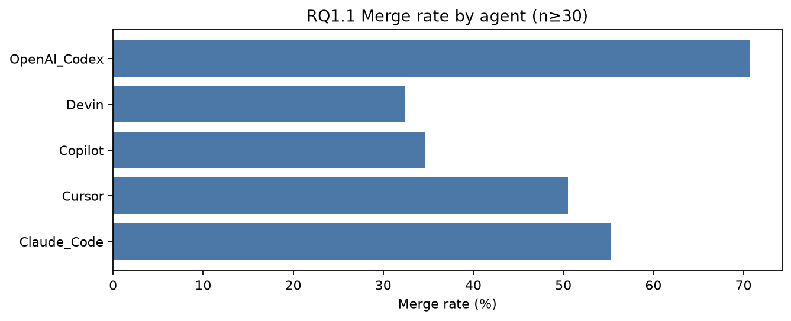
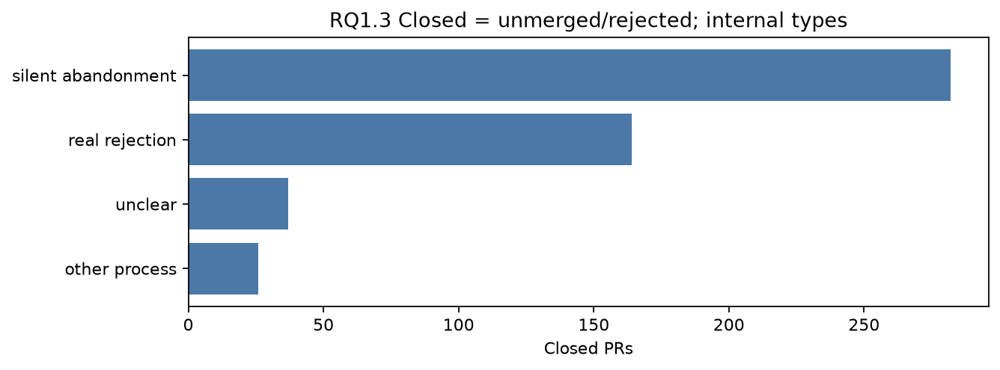
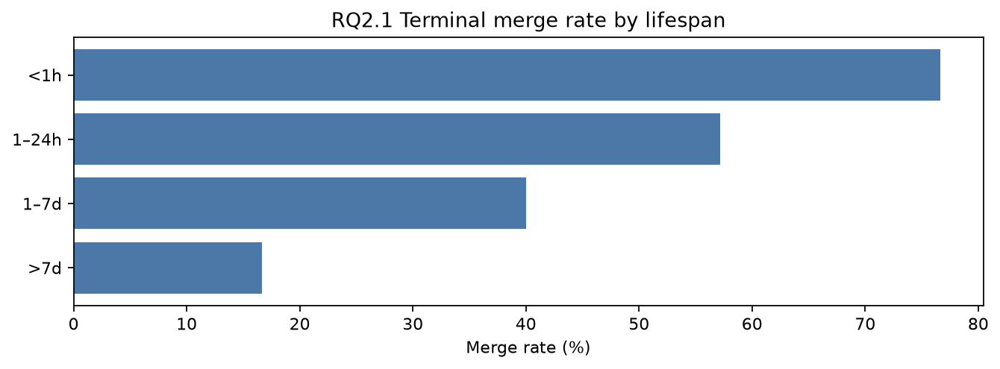
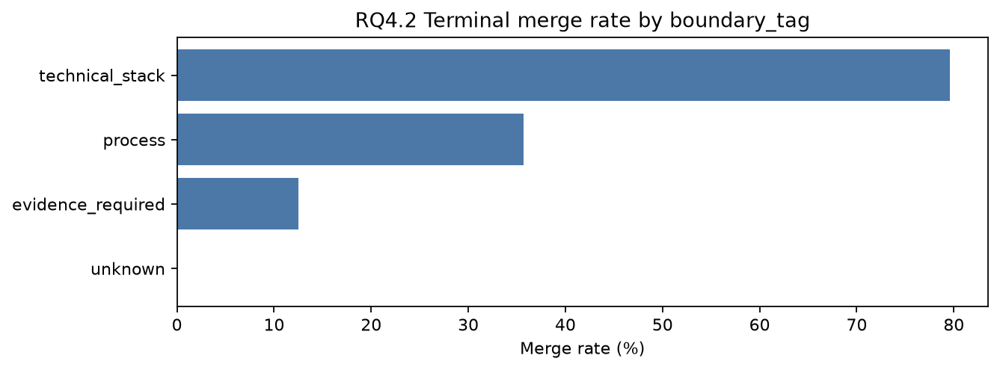

# RQ 分析报告
> 全库 n=**1219**（含 open 39）；研究对照终态 n=**1180**（merged 671 / closed 被拒 509）。终态合并率 **56.9%**。

---

## RQ1 PR 分布：总体分布、Agent 差异、未合并是否等于被拒

### RQ1.1 总体分布与不同 Agent 的合并率表现如何

| 状态 | 操作定义 | 数量 | 占全库 n |
|---|---|---|---|
| merged | 已合入（`merged_at` 非空） | 671 | 55.0% |
| closed（被拒） | 非 merged 且非 open：GitHub 终态未合入 | 509 | 41.8% |
| open | 仍开放；计入全库 n，后续对照不使用 | 39 | 3.2% |

- 全库合并率（分母含 open，n=1219）：**55.0%**。
- **研究用终态合并率**（仅 merged vs closed，n=1180）：**56.9%**；终态被拒率：**43.1%**。
- 下文 RQ1.2 起的 merged / closed 对照均剔除 open。

**按 Agent**：`PR 数` 含 open（算进该 Agent 总数）；**研究对照看终态合并率**（仅 merged+closed）。

| Agent | PR 数（含 open） | merged | closed（被拒） | open | 全库合并率 | 终态合并率 |
|---|---|---|---|---|---|---|
| OpenAI_Codex | 639 | 452 | 177 | 10 | 70.7% | 71.9% |
| Devin | 225 | 73 | 152 | 0 | 32.4% | 32.4% |
| Copilot | 222 | 77 | 127 | 18 | 34.7% | 37.7% |
| Cursor | 95 | 48 | 40 | 7 | 50.5% | 54.5% |
| Claude_Code | 38 | 21 | 13 | 4 | 55.3% | 61.8% |

n≥30 的断层仍然清楚：OpenAI_Codex 合并率最高，Devin / Copilot 明显更低。这是**表现差异**，可能混有任务类型、仓库、补丁规模等影响因素，不能直接写成模型能力证明。

**性能优化层面 Top 12**（全库）：

| optimization_layer | 数量 | 占全库 |
|---|---|---|
| `application_service` | 201 | 16.5% |
| `build` | 165 | 13.5% |
| `frontend_ui` | 137 | 11.2% |
| `runtime_library` | 122 | 10.0% |
| `application_control_flow` | 87 | 7.1% |
| `compiler` | 45 | 3.7% |
| `infrastructure` | 35 | 2.9% |
| `runtime_vm` | 29 | 2.4% |
| `compiler_backend` | 26 | 2.1% |
| `compiler_optimization` | 15 | 1.2% |
| `compiler_codegen` | 14 | 1.1% |
| `test_infrastructure` | 12 | 1.0% |

**RQ1.1 小结**：全库把 open 算进总数后，合入约占 55.0%、被拒（closed）约占 41.8%、仍开放约 3.2%。对照研究只用终态：合并率 56.9%，被拒率 43.1%。不同 Agent 的合入机会差一倍以上；改动主要落在应用服务、构建和前端。

### RQ1.2 Merged 的真实情况如何划分

合入不是单一路径。按行为规则（优先「经审查迭代」，其次「极速低摩擦」，再次「无 formal review」）划分：

| Merged 路径 | 数量 | 占 merged |
|---|---|---|
| 低摩擦快合并 | 507 | 75.6% |
| 经 review 迭代后合入 | 142 | 21.2% |
| 无 formal review 合入（非极速） | 22 | 3.3% |

配套行为事实：

| 指标 | merged |
|---|---|
| 存活时间中位数 | 0.077 小时（约 5 分钟） |
| fast_merge=true | 528（78.7%） |
| 评论数为 0 | 391（58.3%） |
| review_count=0 | 450（67.1%） |

另：全库 1219 条中，无关联 Issue 的有 1004 条（82.4%），不单是 merged 的特征。

**低摩擦快合并示例：**

- [3107735616](https://github.com/MontrealAI/AGI-Alpha-Agent-v0/pull/1377) `OpenAI_Codex` — [alpha_factory] Speed up Pareto front  
  `outcome_reason=merged_small_scope_low_risk`
- [3165644329](https://github.com/ryokun6/ryos/pull/144) `Cursor` — Investigate ai prompt caching issue  
  `outcome_reason=merged_small_scope_low_risk`
- [3169508590](https://github.com/MontrealAI/AGI-Alpha-Agent-v0/pull/2526) `OpenAI_Codex` — [alpha_factory] enhance meta refinement  
  `outcome_reason=merged_fast_self_verify`

**经 review 迭代后合入示例：**

- [3201567268](https://github.com/micropython/micropython/pull/17613) `Claude_Code` — stm32/eth: Improve Ethernet driver with link detection and static IP support.  
  `outcome_reason=merged_after_review_fix`
- [3083186670](https://github.com/dotnet/fsharp/pull/18592) `Copilot` — Auto-generate ILLink.Substitutions.xml to Remove F# Metadata Resources  
  `outcome_reason=merged_after_review_fix`
- [3081345740](https://github.com/dotnet/sdk/pull/49090) `Copilot` — Prevent double-building of Microsoft.DotNet.Cli.Utils.csproj by excluding Publis  
  `outcome_reason=merged_after_review_fix`

**RQ1.2小结**：Merged 的主流是短周期、小范围、常常没有 formal review 的低摩擦合入；经审查来回修改再合入的是少数。把「合入」理解成「高质量审查通过」会严重高估审查深度。

### RQ1.3 Closed 的真实情况如何划分

**口径**：凡是非 merged、非 open 的 PR，一律记为 `closed`，即 GitHub 终态上的 **未合入 / 被拒**（n=509，占全库 41.8%，占终态 43.1%）。open（n=39）只出现在 RQ1.1 的全库总数里，**不进入本小节，也不进入后文 merged vs closed 对照**。

Closed=被拒 是状态层定义，不是「维护者写了拒绝意见」。被拒内部还要按机制再拆，否则会把沉默遗弃和技术否决混成一类。

| Closed 内部类型（均属被拒） | 操作定义 | 数量 | 占 closed | 占终态 | 占全库 |
|---|---|---|---|---|---|
| 真正拒绝 real rejection | 有否决信号：blocking / CHANGES_REQUESTED / 技术或设计类标签 | 164 | 32.2% | 13.9% | 13.5% |
| 沉默遗弃 silent abandonment | 关闭但无明确技术/设计否决：stale、无审查、作者放弃、自动过期 | 282 | 55.4% | 23.9% | 23.1% |
| 其他流程 other_process | 被替代 PR、误提交撤回、重复提交等（仍未合入） | 26 | 5.1% | 2.2% | 2.1% |
| 原因不明 unclear | 现有文本不足以归入以上三类（仍未合入） | 37 | 7.3% | 3.1% | 3.0% |
| **closed 合计（被拒）** | 非 merged 且非 open | 509 | 100% | 43.1% | 41.8% |

在 **509** 条被拒 PR 里，沉默遗弃约占 **55.4%**，真正拒绝约占 **32.2%**。也就是说：状态层全部算被拒；机制层里更多是没人跟、被放下，而不是审完后的技术否决。

沉默遗弃再拆（分母 = silent abandonment）：

| 遗弃子类 | 数量 | 占沉默遗弃 | 占 closed（被拒） |
|---|---|---|---|
| 作者自行关闭 / 放弃 | 100 | 35.5% | 19.6% |
| 无审查互动后被关 | 80 | 28.4% | 15.7% |
| 长期不活跃后关闭 | 64 | 22.7% | 12.6% |
| bot / 自动过期关闭 | 38 | 13.5% | 7.5% |

Closed 中 `blocking=true` 仅 89 条；「真正被审过或有否决信号」的子集 195 条（38.3% of closed）。其余多数被拒发生在几乎没有审查文本的情况下——这是遗弃，不是书面 reject，但终态仍是未合入。

**真正拒绝示例：**

- [2876006908](https://github.com/zenml-io/zenml/pull/3375) `Claude_Code` — Improve list and collection materializers performance  
  `outcome_reason=rejected_design_approach`；拒因摘要：Maintainer CHANGES_REQUESTED with inline comment stating the code is not using ZenML materializers and instead uses pickle for everything, requiring a major rework.
- [3194284966](https://github.com/vercel/turborepo/pull/10623) `Cursor` — perf: improve hashing performance for manual path  
  `outcome_reason=missing_benchmark`；拒因摘要：Maintainer anthonyshew closed the PR agreeing that real benchmarking is required before accepting the change.
- [3198922993](https://github.com/dotnet/msbuild/pull/12109) `Copilot` — Detect and log dev drive at the start of build  
  `outcome_reason=functional_issues_unresolved`；拒因摘要：Maintainer CHANGES_REQUESTED due to incorrect volume path handling; no follow-up fix; PR closed without merge.

**沉默遗弃示例：**

- [2920955200](https://github.com/Cap-go/capgo/pull/1065) `Devin` — feat(dashboard): add improved app filtering with bundle ID support  
  `outcome_reason=closed_no_human_review_engagement`；拒因摘要：Closed by riderx without comment; no review engagement indicates PR was not accepted.
- [3276815242](https://github.com/elementary-data/dbt-data-reliability/pull/835) `Devin` — Add disable_samples column configuration flag  
  `outcome_reason=closed_by_author_quickly_unverified`；拒因摘要：Closed by author within minutes; no human review; bot reviews positive but not blocking.
- [2920951577](https://github.com/Cap-go/capgo/pull/1064) `Devin` — feat: improve search functionality with pagination and visual feedback  
  `outcome_reason=closed_by_maintainer_no_comment`；拒因摘要：Closed by maintainer riderx without any review or comment after ~11.5 hours.

**RQ1.3 小结**：研究对照里 closed 就是被拒。被拒再分成真正拒绝、沉默遗弃、其他流程、原因不明四类；主导机制是沉默遗弃，真正技术/设计否决大约占被拒的三分之一。

---

## RQ2 成功路径与评审注意力：为何能极短周期低审查合入？为何不审？

本节对照样本仅为终态 PR（merged vs closed）；open 不进入。

### RQ2.1 合并成功的 PR 呈现出哪些行为与特征？

| 存活时间 | 终态 PR 数 | 合并率 |
|---|---|---|
| <1h | 573 | 76.6% |
| 1–24h | 236 | 57.2% |
| 1–7d | 180 | 40.0% |
| >7d | 150 | 16.7% |
| （lifespan 缺失） | 41 | 0.0% |

| changes 分箱 | 终态 PR 数 | 合并率 |
|---|---|---|
| ≤100 | 489 | 61.6% |
| 101–500 | 349 | 52.4% |
| 501–2k | 195 | 54.4% |
| 2k–10k | 107 | 56.1% |
| >10k | 40 | 52.5% |

| 特征 | merged | closed |
|---|---|---|
| 存活时间中位数 | 0.077 h | 23.6 h |
| changes 中位数 | 141 | 172 |
| 评论数中位数 | 0 | 2 |
| 无 formal review | 67.1% | 75.6% |

参考AIDev数据集成功侧常见 `perf_focus`：
`constant_folding`(23), `compiler_optimization`(21), `benchmark_infrastructure`(11), `cache`(8), `lazy_loading`(7), `compile_time_optimization`(7), `caching`(6), `compiler_codegen`(6)

**RQ2.1 小结**：能合入的性能 PR 显著更短命、略更小、互动更少。主流成功画像是「小补丁很快合」，不是「材料齐全、审完再合」。

### RQ2.2 维护者凭何放行？无人审更像质量门槛，还是注意力 / 流程错配？

维护者**可观测**的排查方式（`detection_method`，可多选）：

| detection_method | 全库 | merged | closed |
|---|---|---|---|
| `unknown` | 786（64.5%） | 425 | 339 |
| `code_reading` | 378（31.0%） | 225 | 137 |
| `ci_auto` | 93（7.6%） | 48 | 43 |
| `manual_testing` | 18（1.5%） | 6 | 10 |
| `manual_test` | 8（0.7%） | 7 | 1 |
| `benchmark` | 6（0.5%） | 4 | 2 |
| `load_test` | 5（0.4%） | 2 | 2 |
| `(empty)` | 4（0.3%） | 2 | 2 |

边界标签在终态上的合并率：

| boundary_tag | 终态 n | 终态合并率 |
|---|---|---|
| `technical_stack` | 587 | 79.6% |
| `process` | 560 | 35.7% |
| `evidence_required` | 32 | 12.5% |
| `unknown` | 1 | 0.0% |

| 材料信号 | merged | closed |
|---|---|---|
| body_has_repro_steps | 3.7% | 5.5% |
| body_has_benchmark_table | 2.4% | 6.3% |
| body_has_numeric_perf_claim | 13.0% | 24.8% |
| reproducibility=sufficient | 2.4% | 1.6% |

全库材料评级：

| reproducibility | 数量 | 占全库 |
|---|---|---|
| `insufficient` | 754 | 61.9% |
| `partial` | 240 | 19.7% |
| `unknown` | 200 | 16.4% |
| `sufficient` | 25 | 2.1% |

**放行依据**：可观测时以静态读码为主，CI 自动化是少数，profiler / load_test / benchmark 几乎看不见。`technical_stack` 终态合并率 79.6%，小补丁更容易过。成功 PR 并不更常带 benchmark 表——材料不是这条快路径的必须品。

**为何不审**：无人审既可以合入也可以关闭。merged 中 67.1%、closed 中 75.6% 无 formal review。`process` 边界终态合并率只有 35.7%；82.4% 的 PR 没有关联 Issue，优化常是 Agent 主动发起，不在维护者既有队列里。存活超过 7 天的终态合并率掉到约 17%。这些更像评审注意力和流程错配，而不是「质量门槛把差 PR 拦下来」。

**RQ2.2 小结**：维护者放行主要靠「改动小、读得懂、没把 CI 搞红」；大量 PR 无人审，成功与失败都发生在低注意力环境中。卡住智能体性能 PR 的经常不是审查标准本身，而是有没有人愿意看。

---

## RQ3 失败模式与能力边界：真正被审 / 被拒的 PR 卡在哪里？

### RQ3.1 在真正被审过或被否决的子集中，核心失败类型是什么？

本问**不使用全部 509 条 closed**，只保留有 formal review、`blocking`、`CHANGES_REQUESTED`，或 `review_comment_bucket` 不是 `no_review_text` 的子集：**195** 条（38.3% of closed）。

全量 closed 的 review 分桶（对照用，含无文本）：

| review_comment_bucket | 数量 | 占 closed |
|---|---|---|
| `no_review_text` | 329 | 64.6% |
| `correctness_or_bug` | 66 | 13.0% |
| `design_or_approach` | 61 | 12.0% |
| `performance_related_concern` | 10 | 2.0% |
| `tests_missing_or_requested` | 9 | 1.8% |
| `code_quality` | 3 | 0.6% |
| `scope` | 2 | 0.4% |
| `ci_failure` | 2 | 0.4% |
| 其余长尾标签 | 27 | 5.3% |

被审 / 被否决子集的失败类型：

| 失败类型 | 数量 | 占被审 closed 子集 |
|---|---|---|
| 功能 / 正确性失败 | 85 | 43.6% |
| 设计 / 方案否决 | 51 | 26.2% |
| 其他 / 混合 | 23 | 11.8% |
| 证据 / benchmark 不足 | 14 | 7.2% |
| CI / 测试失败 | 10 | 5.1% |
| 静默或缺乏说明 | 9 | 4.6% |
| 范围过大或越界 | 3 | 1.5% |

**功能 / 正确性示例：**

- [3096300821](https://github.com/dlt-hub/dlt/pull/2691) `OpenAI_Codex` — Update docs watcher to process changed files only  
  `outcome_reason=functional_regression_reintroduced_bug`；拒因摘要：Maintainer zilto CHANGES_REQUESTED due to reproduced ENOSPC error; author sh-rp subsequently closed the PR with comment 'closed in favor of branch'.
- [3198922993](https://github.com/dotnet/msbuild/pull/12109) `Copilot` — Detect and log dev drive at the start of build  
  `outcome_reason=functional_issues_unresolved`；拒因摘要：Maintainer CHANGES_REQUESTED due to incorrect volume path handling; no follow-up fix; PR closed without merge.
- [3147449966](https://github.com/microsoft/fluentui-blazor/pull/3921) `Copilot` — [DataGrid] Add IsFixed parameter  
  `outcome_reason=closed_after_approval_no_merge_unknown`；拒因摘要：Despite multiple approvals, the PR was closed without merge; no explicit rejection reason provided in review text.

**设计 / 方案否决示例：**

- [2876006908](https://github.com/zenml-io/zenml/pull/3375) `Claude_Code` — Improve list and collection materializers performance  
  `outcome_reason=rejected_design_approach`；拒因摘要：Maintainer CHANGES_REQUESTED with inline comment stating the code is not using ZenML materializers and instead uses pickle for everything, requiring a major rework.
- [3137902575](https://github.com/PowerShell/vscode-powershell/pull/5212) `Copilot` — Build: Use --follow-symlinks in VSCE  
  `outcome_reason=agent_blocked_by_review_visibility`；拒因摘要：Maintainer CHANGES_REQUESTED with specific fixes; Copilot unable to view inline comments; PR closed without further iteration.
- [3184463362](https://github.com/dotnet/maui/pull/30291) `Copilot` — Fix RealParent garbage collection warning to reduce noise in production apps  
  `outcome_reason=abandoned_after_testing`；拒因摘要：Maintainer used PR as a test for Copilot instructions; after multiple resets and instruction updates, PR was closed without merge, likely because the process was experimental.

反模式（`inefficiency_antipattern` ≠ none）只作伴随现象：

- Merged 侧 Top：
`repeated_io`(32), `nested_loop`(9), `lock_misuse`(2), `main_thread_blocking`(2), `memory_leak`(2), `string_traversal`(2)

- Closed 侧 Top：
`repeated_io`(36), `nested_loop`(5), `lock_misuse`(3), `repeated_computation`(2), `redundant_computation`(2), `blocking_io`(2)

两侧都是 `repeated_io` 最多，数量接近，**不能当成主拒因**。

**RQ3.1 小结**：一旦把「没人看就关了」的 PR 拿掉，剩下的失败更接近「补丁错了 / 方案不对 / CI 过不了 / 缺材料」。静默 maintainer 关闭仍需单独看待，它介于拒绝和遗弃之间。

### RQ3.2 证据生成、流程协作与同 PR 修复分别暴露了哪些能力边界？

三条既有 `boundary_tag` 直接对应三种非代码能力：

| 边界 | 含义 | 终态 n | 终态合并率 |
|---|---|---|---|
| `technical_stack` | 常规技术栈改动（Agent 相对能做） | 587 | 79.6% |
| `process` | 协作 / 审查 / 流程推进 | 560 | 35.7% |
| `evidence_required` | 维护者要求可复现性能证据 | 32 | 12.5% |

**证据边界示例（evidence_required × closed）：**

- [2839448717](https://github.com/pyth-network/pyth-crosschain/pull/2359) `Devin` — build: add parallel and concurrency flags to test:ci and build:ci  
  `outcome_reason=no_performance_improvement`；拒因摘要：Agent self-closed after concluding no performance improvement; no external CHANGES_REQUESTED.
- [3033886992](https://github.com/calcom/cal.com/pull/21052) `Devin` — perf: optimize app loading and rendering performance with CI fix  
  `outcome_reason=closed_harmful_ci_change_fabricated_benchmark`；拒因摘要：PR closed after retrogtx's 'insane, closing' comment on type-check CI change; no further fixes attempted.
- [3053649404](https://github.com/calcom/cal.com/pull/21220) `Devin` — perf: optimize .tz() calls with proper timezone detection  
  `outcome_reason=closed_not_performance_focused_approach`；拒因摘要：Devin AI bot closed the PR, stating the approach was not properly focused on performance optimization.

退化 / 审查问题处置（`regression_handling`）：

| regression_handling | 数量 | 占全库 |
|---|---|---|
| `not_applicable` | 626 | 51.4% |
| `reject_close` | 397 | 32.6% |
| `fix_in_pr` | 148 | 12.1% |
| `unknown` | 20 | 1.6% |
| `ignore` | 18 | 1.5% |
| `revert` | 2 | 0.2% |
| `fix_followup` | 2 | 0.2% |
| `close_no_merge` | 1 | 0.1% |
| `fix_pending` | 1 | 0.1% |
| `abandon` | 1 | 0.1% |
| `recreated_in_new_pr` | 1 | 0.1% |
| `closed_no_merge` | 1 | 0.1% |
| `draft_converted_no_fix` | 1 | 0.1% |

`fix_in_pr` 共 148 条（12.1%）。修复主体启发式：

| 修复模式 | 数量 | 占 fix_in_pr |
|---|---|---|
| human_led_or_requested | 82 | 55.4% |
| ai_author_in_pr | 33 | 22.3% |
| human_ai_collaborative | 22 | 14.9% |
| unclear | 11 | 7.4% |

`antipattern_in_fix` 非 none 共 **8** 条（0.7%），只说明二次引入反模式是稀有风险，不能当核心发现。`revert` 极少。

**RQ3.2 小结**：

- **证据生成**：一进入 `evidence_required`，终态合并率掉到约一成；全库 sufficient 材料只有约 2%。
- **流程协作**：process 边界合入率大约只有 technical_stack 的一半；closed 里沉默遗弃仍是大头。
- **同 PR 修复**：能在原 PR 里把问题修完的是少数，且过半要人类主导。Agent 独立消化 CHANGES_REQUESTED 的能力有限。

---

## RQ4 核心差异：合入与关闭差在哪？能力边界是否影响结果？如何提高合并率？

### RQ4.1 成功合入与失败 / 搁置在核心维度上有何显著差异？

| 维度 | Merged | Closed | 读法 |
|---|---|---|---|
| 寿命 | 中位 0.077 h，fast_merge 78.7% | 中位 23.6 h，fast_merge 0 | 成功是快路径 |
| 规模 | 中位 changes 141；≤100 行档合并率最高 | 中位 172 | 小补丁占优，但 >10k 仍可合，不能写成越大越不能合 |
| 互动 | 评论中位 0；58.3% 为 0 | 评论中位 2 | 高评论量不对应更高合并率 |
| 材料 | benchmark 表 2.4%；数字声称 13.0% | benchmark 表 6.3%；数字声称 24.8% | Closed 更常给证据，证据是难 PR 门槛而非成功标配 |

**perf_focus 对照**

- Merged：
`constant_folding`(23), `compiler_optimization`(21), `benchmark_infrastructure`(11), `cache`(8), `lazy_loading`(7), `compile_time_optimization`(7), `caching`(6), `compiler_codegen`(6)

- Closed：
`bundle_size_reduction`(12), `constant_folding`(10), `cache`(9), `build_performance`(7), `caching`(6), `lazy_load`(6), `code_splitting`(6), `compiler_optimization`(6)

成功侧更偏常量折叠、编译优化、缓存；关闭侧更常见包体积、复杂构建、code splitting。

### RQ4.2 合入和关闭在 AI 能力边界上有哪些区别？是否影响合并结果？

终态合并率按 `optimization_layer`（n≥20）：

| optimization_layer | 终态 n | 终态合并率 |
|---|---|---|
| `compiler_backend` | 26 | 84.6% |
| `compiler` | 45 | 80.0% |
| `application_control_flow` | 83 | 59.0% |
| `build` | 162 | 58.0% |
| `infrastructure` | 33 | 57.6% |
| `runtime_library` | 116 | 56.9% |
| `application_service` | 193 | 51.8% |
| `frontend_ui` | 134 | 50.0% |
| `runtime_vm` | 29 | 24.1% |

**现象（描述性）**：能力边界和合并结果同向变化。

- 落在 `technical_stack` 的 PR 终态合并率接近八成：小范围、可模板化的缓存 / 常量 / 编译类改动。
- 落在 `process` 的 PR 只有约三成合入：无人审、stale、作者放弃。这是协作边界，不一定是代码写错。
- 落在 `evidence_required` 的 PR 终态合并率约一成：维护者要数字，Agent 给的是叙述。
- 层面信号一致但样本更小：`compiler` / `compiler_backend` 合入高，`runtime_vm` 明显低。

因此：**存在「能力边界与合并结果一起分层」的现象**，但还不是「边界导致失败」的因果证明。流程边界尤其可能是维护者注意力问题，而不是 Agent 写不出补丁。

### RQ4.3 针对现有缺陷，有哪些可操作改进能提高合并率？

针对 RQ1-3 的现象可以做出提升合并率的总结

**方法 A — 已经存在的低摩擦合入快路径（RQ1.2 / RQ2）**

- 保持原子补丁，优先 `technical_stack` 上的改动。
- 降低维护者注意力成本：标题/正文写清「改了什么、为什么安全」，而不是先堆 benchmark。
- 无 Issue 的主动优化不要默认丢进需要深度审的队列；需要仓库侧的分诊（bot 标 `small/perf-safe`）。
- **不要**强制所有 PR <100 行：≤100 行合并率最高，但大 PR 仍有约一半合入。

**方法 B — 需要被认真审的慢路径 PR（RQ1.3 / RQ3）**

- 工具链补可复现材料：前后对比表 + 复现步骤，对准 `evidence_required` 的标准，而不是给快合并路径加表。
- Review 阶段把 CHANGES_REQUESTED 当成一等任务；当前 `fix_in_pr` 过半是人类主导，Agent 需要稳定消化审查意见。
- 对 `runtime_vm`、大范围控制流、包体积类改动提前声明风险，或拆成可独立合入的证据提交 + 代码提交。
- 沉默遗弃是注意力问题：超时提醒、把 stale bot 关闭改成「需要 maintainer 一句话」而不是直接关。

**明确不支持的说法**：Closed 组更常带数字声称和 benchmark 表，因此「给所有性能 PR 加 benchmark 就会提高合并率」与现有相关方向相反。Benchmark 应留给被要求举证的难 PR。

---

## 总结

1. **RQ1**：全库数据集含 open 的PR；对照只用 merged 和 closed。Closed 即终态被拒，内部以沉默遗弃为主，真正技术/设计拒绝约占被拒三分之一。Merged 以低摩擦快合并为主。Agent 之间终态合并率差一倍以上。
2. **RQ2**：成功 PR 极短命、常无审查；放行靠读码和小补丁，不靠 profiler。无人审同时出现在合入和关闭两侧，更像注意力 / 流程问题。
3. **RQ3**：真正被审的失败以正确性、设计、CI 为主；证据边界和流程边界比单纯技术栈改动更能解释合不进去；同 PR 修复少且依赖人类。
4. **RQ4**：寿命、边界类型、优化层面差异清楚，材料差异方向与「多写 benchmark 就能合」相反。改进必须分快路径和慢路径。
